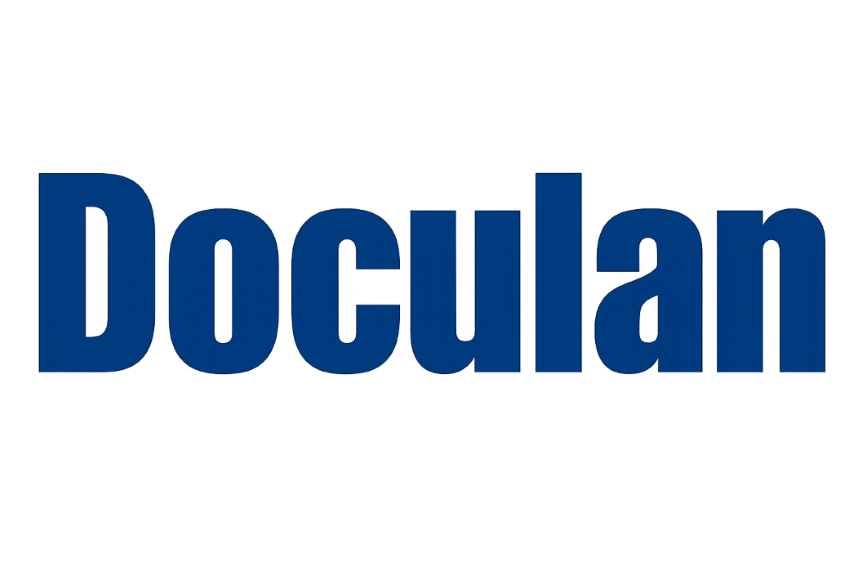

<!-- Logo -->

  

<!-- Product Image / Icon -->

  

<!-- # Doculan -->

<!-- 

  <strong>Doculan</strong>

 -->

> **Doculan** is an all-in-one platform to create documents and forms, manage contacts, and securely **E-Sign** files with ease.

  <strong>Fast • Simple • Lightweight Platform</strong>

 

<!-- HEAD -->
<!-- [GitHub](https://github.com/virtualansoftware) -->

[Getting Started](README.md)
=======

  <a href="#/README">
    <button style="
      background:#2bb673;
      color:#fff;
      border:none;
      font-size:16px;
      border-radius:30px;
      cursor:pointer;
    ">
      Getting Started
    </button>
  </a>

<!-- cdbe3811c0fae7688eb369129ddcab8c977b8f67 -->
